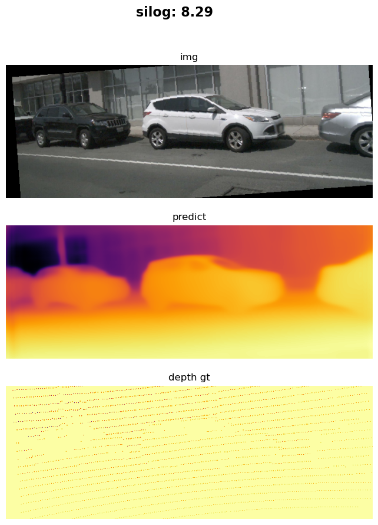
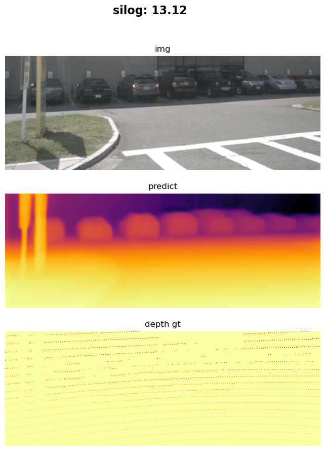

# Monocular depth estimation on nuScenes Dataset by Unidepth

## Introduction

<div style="display: flex; justify-content: space-between;">
  <div style="text-align: center;">
    <p>Samples of Prediction</p>
    
  </div>
  <div style="text-align: center;">
    <p>Samples of Prediction</p>
    
  </div>
</div>

## Setup
This software depends on the following Python packages:
```
mmcv                      2.1.0
mmdet                     3.3.0
mmdet3d                   1.4.0
mmengine                  0.10.5
```

Other pakages is the same as [Unidepth](https://github.com/lpiccinelli-eth/UniDepth).Please follow [Unidepth](https://github.com/lpiccinelli-eth/UniDepth) Get Start to prepare other pakages like pytorch. 
CUDA is recommended for best performances. Version 11.7 was used during development

## Data Preparation
- Donwload nuScenes mini data set from [nuScenes website](https://www.nuscenes.org/) (note: you can use  raw dataset download script (1 MB) )

- Follow Data preprocessing step by [BEVDepth](https://github.com/Megvii-BaseDetection/BEVDepth)
- change the dataroot to your dataroot (e.g. '/home/zzhang/work/BEVDepth/data/nuScenes')


## Usage
### Quick test
To quickly try out the code:
```bash
  python3 demo_on_nuscenes.py
  ```

### Evaluating 
```bash
  python3 eval.py 
  ```